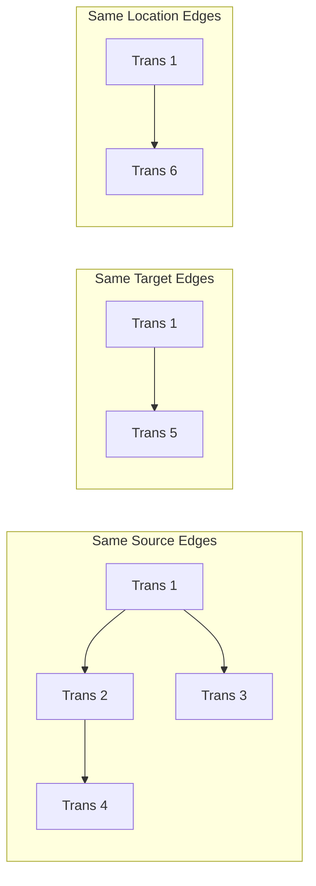
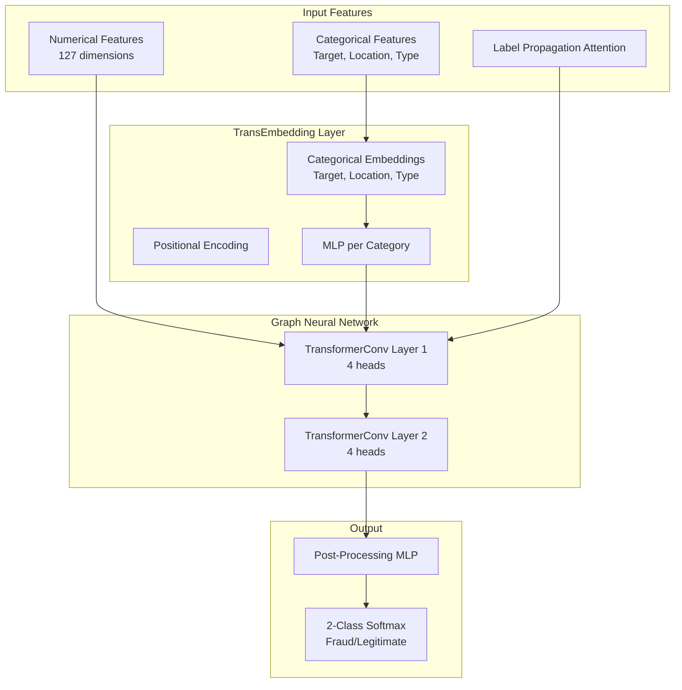
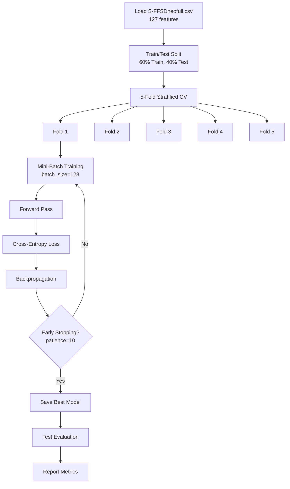
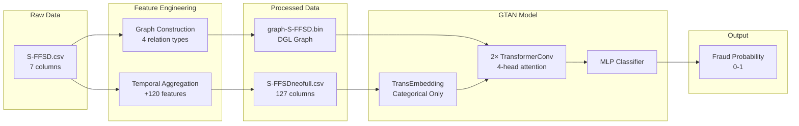

# GTAN Model Implementation - Complete Walkthrough

This document provides a comprehensive, detailed explanation of how the **GTAN (Graph Temporal Attention Network)** model was built for fraud detection.

---

## 1. Dataset Overview

GTAN uses the same base dataset as RGTAN but with a **simpler feature set** (no neighbor risk-aware features).

### 1.1 Raw Dataset: S-FFSD

The raw dataset is stored in [`S-FFSD.csv`](file:///c:/Users/Ski/Downloads/intern%206week/antifraud_cpu/data/S-FFSD.csv).

#### Raw Dataset Fields (7 columns):

| Field | Description | Example Values |
|-------|-------------|----------------|
| **Time** | Transaction timestamp (numeric, sequential order) | `0`, `1`, `2`, ... |
| **Source** | Source account/entity ID | `S10000`, `S10001`, ... |
| **Target** | Target account/entity receiving the transaction | `T1000`, `T1001`, ... |
| **Amount** | Transaction amount (numeric) | `13.74`, `73.17`, `68.59`, ... |
| **Location** | Location code where transaction occurred | `L100`, `L101`, `L102`, ... |
| **Type** | Transaction type code | `TP100`, `TP101`, `TP102`, ... |
| **Labels** | Fraud label: `0` = legitimate, `1` = fraudulent, `2` = unlabeled | `0`, `1`, `2` |

---

## 2. Data Preprocessing Pipeline

### 2.1 Temporal Feature Engineering

**Same as RGTAN:** The system generates temporal aggregation features over **15 time windows**:

```python
time_span = [2, 3, 5, 15, 20, 50, 100, 150, 200, 300, 864, 2590, 5100, 10000, 24000]
```

#### Generated Features (8 per time window × 15 windows = 120 features):

| Feature | Description |
|---------|-------------|
| `trans_at_avg_{T}` | Average amount in past T time units |
| `trans_at_totl_{T}` | Total amount in past T time units |
| `trans_at_std_{T}` | Standard deviation of amounts |
| `trans_at_bias_{T}` | Current amount - average (anomaly indicator) |
| `trans_at_num_{T}` | Transaction count |
| `trans_target_num_{T}` | Unique targets count |
| `trans_location_num_{T}` | Unique locations count |
| `trans_type_num_{T}` | Unique types count |

### 2.2 Processed Dataset

**Output:** [`S-FFSDneofull.csv`](file:///c:/Users/Ski/Downloads/intern%206week/antifraud_cpu/data/S-FFSDneofull.csv)

| Category | Fields | Count |
|----------|--------|-------|
| **Original Fields** | Time, Source, Target, Amount, Location, Type, Labels | 7 |
| **Temporal Features** | All `trans_*` features | 120 |
| **Total** | | **127** |

### 2.3 Graph Construction

**File:** [`methods/gtan/gtan_main.py`](file:///c:/Users/Ski/Downloads/intern%206week/antifraud_cpu/methods/gtan/gtan_main.py) → `load_gtan_data()` function

Transactions are connected into a graph based on **4 shared attributes**:

```python
pair = ["Source", "Target", "Location", "Type"]
edge_per_trans = 3  # Connect to 3 nearest temporal neighbors
```

#### Graph Construction Algorithm:

1. **Group by attribute** (Source, Target, Location, Type)
2. **Sort by time** within each group
3. **Create directed edges** to the next 3 temporal neighbors
4. **Combine** all edge types into a single graph



### 2.4 Label Encoding

Categorical features are encoded before graph creation:

```python
cal_list = ["Source", "Target", "Location", "Type"]
for col in cal_list:
    le = LabelEncoder()
    data[col] = le.fit_transform(data[col].apply(str).values)
```

### 2.5 Graph Data Structure: DGL (Deep Graph Library)

The graph is built using **DGL (Deep Graph Library)** with PyTorch tensors.

#### Core Structure: Edge List → DGL Graph

```python
import dgl
import numpy as np

# Create two arrays - source nodes and target nodes
alls = np.array([0, 0, 1, 1, 2, 3, 3])  # Source transaction indices
allt = np.array([1, 2, 2, 3, 3, 4, 5])  # Target transaction indices

# Create the directed graph
g = dgl.graph((alls, allt))
```

#### Internal Representation: COO (Coordinate) Sparse Format

Edges are stored as coordinate pairs, memory-efficient for sparse graphs:

```
Edge 0: (0 → 1)    Edge 3: (1 → 3)    Edge 6: (3 → 5)
Edge 1: (0 → 2)    Edge 4: (2 → 3)
Edge 2: (1 → 2)    Edge 5: (3 → 4)
```

#### Node and Edge Features (PyTorch Tensors)

```python
# Attach 127-dimensional features to each node (transaction)
g.ndata['feat'] = torch.from_numpy(feat_data.to_numpy()).to(torch.float32)

# Attach labels (0=normal, 1=fraud, 2=unknown)
g.ndata['label'] = torch.from_numpy(labels.to_numpy()).to(torch.long)
```

#### Edge Creation Algorithm

For each attribute (Source, Target, Location, Type), transactions are connected to their **next 3 temporal neighbors**:

```python
for column in ["Source", "Target", "Location", "Type"]:
    for c_id, c_df in data.groupby(column):      # Group by attribute
        c_df = c_df.sort_values(by="Time")       # Sort by time
        for i in range(len(c_df)):
            for j in range(1, 4):                # Connect to next 3
                if i + j < len(c_df):
                    src.append(c_df.index[i])
                    tgt.append(c_df.index[i + j])
```

#### Data Structures Summary

| Component | Data Structure | Storage |
|-----------|----------------|---------|
| **Edge connections** | COO Sparse Matrix | Memory-efficient |
| **Node features** | PyTorch Tensor `(N, 127)` | `g.ndata['feat']` |
| **Node labels** | PyTorch Tensor `(N,)` | `g.ndata['label']` |
| **Full graph** | DGL Graph Object | `graph-S-FFSD.bin` |

---

## 3. Key Difference: GTAN vs RGTAN

| Feature | GTAN | RGTAN |
|---------|------|-------|
| **Neighbor Risk Features** | ❌ Not used | ✅ 6 features (degree, riskstat, 1hop/2hop) |
| **1D CNN for Risk Stats** | ❌ Not present | ✅ Tabular1DCNN2 module |
| **Multi-Head Attention for Risks** | ❌ Not present | ✅ Configurable heads (9 for S-FFSD) |
| **Feature Dimension** | 127 (temporal only) | 127 + 6 = 133 (temporal + neighbor) |
| **Model Class** | `GraphAttnModel` | `RGTAN` |

> **GTAN is essentially RGTAN without the Risk-aware Neighbor Statistics module.**

---

## 4. Model Architecture

**File:** [`methods/gtan/gtan_model.py`](file:///c:/Users/Ski/Downloads/intern%206week/antifraud_cpu/methods/gtan/gtan_model.py)

### 4.1 Architecture Diagram



### 4.2 Component Details

#### 4.2.1 PosEncoding (Positional Encoding)

Encodes temporal information using sinusoidal functions:

```python
class PosEncoding(nn.Module):
    def __init__(self, dim, device, base=10000, bias=0):
        # Generates sin/cos encoding for temporal features
        for i in range(dim):
            b = (i - i % 2) / dim
            p.append(base ** -b)
            sft.append(np.pi / 2.0 + bias if i % 2 else bias)
    
    def forward(self, pos):
        x = pos / self.base + self.sft
        return torch.sin(x)
```

#### 4.2.2 TransEmbedding (Transaction Embedding)

Creates learnable embeddings for categorical features:

```python
class TransEmbedding(nn.Module):
    def __init__(self, df, device, dropout=0.2, in_feats=82, cat_features=None):
        # Embedding tables for Target, Location, Type
        self.cat_table = nn.ModuleDict({
            col: nn.Embedding(max(df[col].unique())+1, in_feats)
            for col in cat_features
        })
        
        # MLP for each category
        self.forward_mlp = nn.ModuleList([
            nn.Linear(in_feats, in_feats) 
            for i in range(len(cat_features))
        ])
    
    def forward(self, df):
        # Sum embeddings from all categories
        output = sum(self.forward_mlp[i](self.cat_table[col](df[col])) 
                     for i, col in enumerate(cat_features))
        return output
```

**Categorical Features Used:**
- `Target` - Transaction recipient
- `Location` - Transaction location
- `Type` - Transaction type

#### 4.2.3 TransformerConv (Graph Transformer Convolution)

Message passing layer using scaled dot-product attention:

```python
class TransformerConv(nn.Module):
    def forward(self, graph, feat):
        # Step 0: Linear projections for Q, K, V
        q_src = self.lin_query(h_src)  # Query from source nodes
        k_dst = self.lin_key(h_dst)    # Key from destination nodes
        v_src = self.lin_value(h_src)  # Value from source nodes
        
        # Step 1: Compute attention scores (dot product)
        graph.apply_edges(fn.u_dot_v('ft', 'ft', 'a'))
        
        # Step 2: Scaled edge softmax
        graph.edata['sa'] = edge_softmax(graph, graph.edata['a'] / sqrt(d))
        
        # Step 3: Weighted aggregation
        graph.update_all(fn.u_mul_e('ft_v', 'sa', 'attn'), fn.sum('attn', 'agg_u'))
        
        # Gated skip connection
        gate = sigmoid(self.gate([skip_feat, rst, skip_feat - rst]))
        rst = gate * skip_feat + (1 - gate) * rst
        
        # Layer normalization + activation
        rst = self.layer_norm(rst)
        rst = self.activation(rst)  # PReLU
```

**Key Components:**
- **Multi-Head Attention:** 4 attention heads
- **Gated Skip Connection:** `gate * skip + (1-gate) * aggregated`
- **Layer Normalization:** For training stability
- **PReLU Activation:** Learnable negative slope

#### 4.2.4 GraphAttnModel (Main Model)

```python
class GraphAttnModel(nn.Module):
    def __init__(self, in_feats=127, hidden_dim=64, n_layers=2, n_classes=2, ...):
        # Label embedding for semi-supervised learning
        self.layers.append(nn.Embedding(n_classes+1, in_feats, padding_idx=n_classes))
        
        # Linear projections
        self.layers.append(nn.Linear(in_feats, hidden_dim * heads[0]))
        self.layers.append(nn.Linear(in_feats, hidden_dim * heads[0]))
        
        # Fusion layer: BatchNorm -> PReLU -> Dropout -> Linear
        self.layers.append(nn.Sequential(...))
        
        # 2 TransformerConv layers
        for l in range(n_layers):
            self.layers.append(TransformerConv(...))
        
        # Post-processing MLP
        self.layers.append(nn.Sequential(
            nn.Linear(hidden_dim * heads[-1], hidden_dim * heads[-1]),
            nn.BatchNorm1d(...), nn.PReLU(), nn.Dropout(0.1),
            nn.Linear(..., n_classes)
        ))
    
    def forward(self, blocks, features, labels, n2v_feat=None):
        # Add categorical embeddings to features
        h = features + self.n2v_mlp(n2v_feat)
        
        # Add label embeddings (semi-supervised)
        label_embed = self.layers[0](labels)
        h = h + self.layers[3](self.layers[1](h) + self.layers[2](label_embed))
        
        # Graph convolution layers
        for l in range(n_layers):
            h = self.layers[l+4](blocks[l], h)
        
        # Classification
        logits = self.layers[-1](h)
        return logits
```

---

## 5. Training Process

**File:** [`methods/gtan/gtan_main.py`](file:///c:/Users/Ski/Downloads/intern%206week/antifraud_cpu/methods/gtan/gtan_main.py) → `gtan_main()` function

### 5.1 Training Configuration

From [`config/gtan_cfg.yaml`](file:///c:/Users/Ski/Downloads/intern%206week/antifraud_cpu/config/gtan_cfg.yaml):

```yaml
batch_size: 128
hid_dim: 256            # Hidden dimension (÷4 = 64 per head)
lr: 0.003               # Learning rate
wd: 1e-4                # Weight decay (L2 regularization)
n_layers: 2             # Number of TransformerConv layers
dropout: [0.2, 0.1]     # [input_dropout, layer_dropout]
early_stopping: 10      # Patience (more than RGTAN's 3)
n_fold: 5               # K-fold CV (more than RGTAN's 3)
seed: 2023
max_epochs: 15          # More epochs than RGTAN
gated: True             # Use gated skip connections
dataset: S-FFSD
test_size: 0.4          # 40% test (different split!)
```

### 5.2 Training Pipeline



### 5.3 Training Details

1. **Data Sampling:** 
   ```python
   train_sampler = MultiLayerFullNeighborSampler(n_layers=2)
   train_dataloader = NodeDataLoader(graph, train_idx, train_sampler, batch_size=128)
   ```

2. **Optimizer:** Adam with scaled learning rate
   ```python
   lr = args['lr'] * np.sqrt(batch_size / 1024)  # ≈ 0.00106
   optimizer = optim.Adam(model.parameters(), lr=lr, weight_decay=1e-4)
   ```

3. **Learning Rate Scheduler:** MultiStepLR
   ```python
   lr_scheduler = MultiStepLR(optimizer, milestones=[4000, 12000], gamma=0.3)
   ```

4. **Loss Function:** Cross-Entropy Loss
   ```python
   loss_fn = nn.CrossEntropyLoss()
   
   # Mask unlabeled samples (label=2) during training
   mask = batch_labels == 2
   train_batch_logits = train_batch_logits[~mask]
   batch_labels = batch_labels[~mask]
   ```

5. **Early Stopping:** Monitor validation loss with patience=10

### 5.4 Label Propagation Attention (LPA)

**File:** [`methods/gtan/gtan_lpa.py`](file:///c:/Users/Ski/Downloads/intern%206week/antifraud_cpu/methods/gtan/gtan_lpa.py)

Semi-supervised learning mechanism:

```python
def load_lpa_subtensor(node_feat, work_node_feat, labels, seeds, input_nodes, device):
    # Get features for input nodes
    batch_inputs = node_feat[input_nodes]
    
    # Get categorical features
    batch_work_inputs = {col: work_node_feat[col][input_nodes] for col in work_node_feat}
    
    # Labels for batch nodes
    batch_labels = labels[seeds]
    
    # Propagate labels: mask current batch to 2 (unknown)
    propagate_labels = labels[input_nodes].clone()
    propagate_labels[:seeds.shape[0]] = 2  # Mask batch labels
    
    return batch_inputs, batch_work_inputs, batch_labels, propagate_labels
```

This enables the model to:
- Learn from labeled neighbors
- Predict labels for masked (unknown) nodes
- Leverage graph structure for semi-supervised learning

---

## 6. Evaluation

### 6.1 Test Evaluation

After training, the best model from each fold is evaluated:

```python
b_model = earlystoper.best_model
b_model.eval()

with torch.no_grad():
    for input_nodes, seeds, blocks in test_dataloader:
        test_batch_logits = b_model(blocks, inputs, lpa_labels, work_inputs)
        test_predictions[seeds] = test_batch_logits
```

### 6.2 Metrics

| Metric | Description |
|--------|-------------|
| **AUC-ROC** | Area Under ROC Curve |
| **F1-Score** | Macro-averaged F1 |
| **AP** | Average Precision |

```python
print("test AUC:", roc_auc_score(y_target, test_score))
print("test f1:", f1_score(y_target, test_score1, average="macro"))
print("test AP:", average_precision_score(y_target, test_score))
```

---

## 7. Summary: GTAN Pipeline



---

## 8. Key Files Summary

| File | Purpose |
|------|---------|
| [`main.py`](file:///c:/Users/Ski/Downloads/intern%206week/antifraud_cpu/main.py) | Entry point, parses args |
| [`config/gtan_cfg.yaml`](file:///c:/Users/Ski/Downloads/intern%206week/antifraud_cpu/config/gtan_cfg.yaml) | Training hyperparameters |
| [`methods/gtan/gtan_main.py`](file:///c:/Users/Ski/Downloads/intern%206week/antifraud_cpu/methods/gtan/gtan_main.py) | Data loading & training |
| [`methods/gtan/gtan_model.py`](file:///c:/Users/Ski/Downloads/intern%206week/antifraud_cpu/methods/gtan/gtan_model.py) | Model architecture |
| [`methods/gtan/gtan_lpa.py`](file:///c:/Users/Ski/Downloads/intern%206week/antifraud_cpu/methods/gtan/gtan_lpa.py) | Label propagation |
| [`streamlit_app.py`](file:///c:/Users/Ski/Downloads/intern%206week/antifraud_cpu/streamlit_app.py) | Interactive dashboard |

---

## 9. Running the Model

### Training:
```powershell
python main.py --method gtan
```

### Dashboard Inference:
```powershell
& 'cpu_env\Scripts\streamlit.exe' run streamlit_app.py
```

---

## 10. Comparison: GTAN vs RGTAN

| Aspect | GTAN | RGTAN |
|--------|------|-------|
| **Input Features** | 127 (temporal only) | 127 + 6 = 133 |
| **Neighbor Risk Stats** | ❌ | ✅ |
| **1D CNN Module** | ❌ | ✅ |
| **Risk Attention Heads** | N/A | 9 for S-FFSD |
| **K-Fold** | 5 | 3 |
| **Early Stopping Patience** | 10 | 3 |
| **Max Epochs** | 15 | 5 |
| **Test Size** | 40% | 60% |

**RGTAN is an extension of GTAN that adds Risk-aware Neighbor Statistics to capture fraud patterns in the graph neighborhood.**
