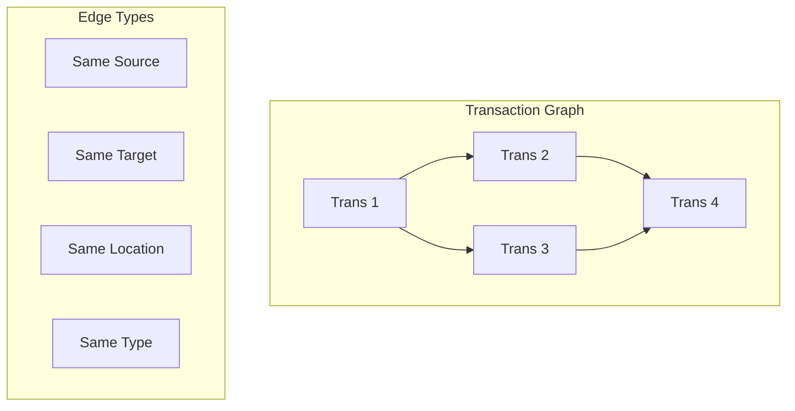
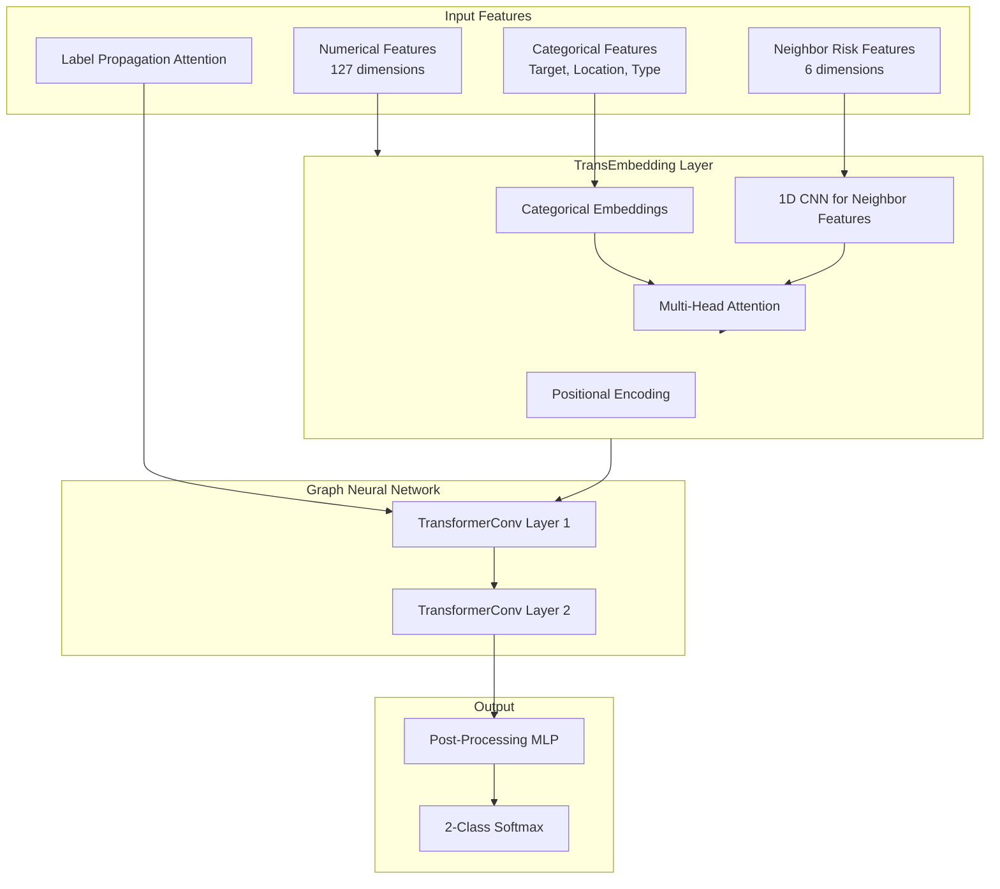
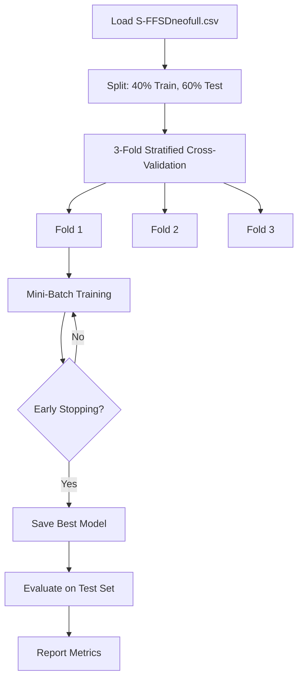
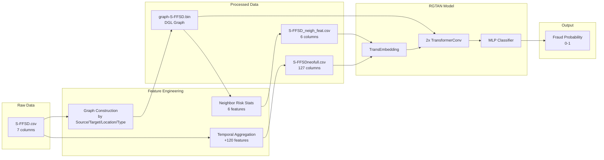

# RGTAN Model Implementation - Complete Walkthrough

This document provides a comprehensive, detailed explanation of how the **RGTAN (Risk-aware Graph Temporal Attention Network)** model was built for fraud detection.

---

## 1. Dataset Overview

### 1.1 Raw Dataset: S-FFSD (Simulated-Financial Fraud Semi-supervised Dataset)

The raw dataset is stored in [`S-FFSD.csv`](file:///c:/Users/Ski/Downloads/intern%206week/antifraud_cpu/data/S-FFSD.csv) and represents financial transaction records.

#### Raw Dataset Fields (7 columns):

| Field | Description | Example Values |
|-------|-------------|----------------|
| **Time** | Transaction timestamp (numeric, represents sequential order) | `0`, `1`, `2`, ... |
| **Source** | Source account/entity ID | `S10000`, `S10001`, ... |
| **Target** | Target account/entity receiving the transaction | `T1000`, `T1001`, ... |
| **Amount** | Transaction amount (numeric) | `13.74`, `73.17`, `68.59`, ... |
| **Location** | Location code where transaction occurred | `L100`, `L101`, `L102`, ... |
| **Type** | Transaction type code | `TP100`, `TP101`, `TP102`, ... |
| **Labels** | Fraud label: `0` = legitimate, `1` = fraudulent, `2` = unlabeled | `0`, `1`, `2` |

---

## 2. Data Preprocessing Pipeline

The preprocessing pipeline transforms raw transaction data into graph-based features suitable for the RGTAN model. This occurs in two main phases:

### 2.1 Phase 1: Temporal Feature Engineering

**File:** [`feature_engineering/data_process.py`](file:///c:/Users/Ski/Downloads/intern%206week/antifraud_cpu/feature_engineering/data_process.py) → `featmap_gen()` function

For each transaction, the system looks backward across **15 time windows** to generate aggregated statistics:

```python
time_span = [2, 3, 5, 15, 20, 50, 100, 150, 200, 300, 864, 2590, 5100, 10000, 24000]
```

#### Generated Features per Time Window:

For each of the 15 time windows, **8 features** are generated:

| Feature Pattern | Description |
|-----------------|-------------|
| `trans_at_avg_{T}` | Average transaction amount in the past T time units |
| `trans_at_totl_{T}` | Total transaction amount in the past T time units |
| `trans_at_std_{T}` | Standard deviation of amounts in the past T time units |
| `trans_at_bias_{T}` | Difference between current amount and average (anomaly detection) |
| `trans_at_num_{T}` | Number of transactions in the past T time units |
| `trans_target_num_{T}` | Number of unique targets in the past T time units |
| `trans_location_num_{T}` | Number of unique locations in the past T time units |
| `trans_type_num_{T}` | Number of unique transaction types in the past T time units |

**Total temporal features:** 15 time windows × 8 features = **120 features**

### 2.2 Processed Dataset: S-FFSDneofull.csv

**Output:** [`data/S-FFSDneofull.csv`](file:///c:/Users/Ski/Downloads/intern%206week/antifraud_cpu/data/S-FFSDneofull.csv)

#### Processed Dataset Fields (127 columns):

| Category | Fields | Count |
|----------|--------|-------|
| **Original Fields** | Time, Source, Target, Amount, Location, Type, Labels | 7 |
| **Temporal Features** | `trans_at_avg_*`, `trans_at_totl_*`, `trans_at_std_*`, `trans_at_bias_*`, `trans_at_num_*`, `trans_target_num_*`, `trans_location_num_*`, `trans_type_num_*` | 120 |
| **Total** | | **127** |

### 2.3 Phase 2: Graph Construction

**File:** [`methods/rgtan/rgtan_main.py`](file:///c:/Users/Ski/Downloads/intern%206week/antifraud_cpu/methods/rgtan/rgtan_main.py) → `loda_rgtan_data()` function

The graph is constructed by connecting transactions that share common attributes:

```python
pair = ["Source", "Target", "Location", "Type"]
edge_per_trans = 3  # Connect to 3 nearest temporal neighbors
```

#### Graph Construction Algorithm:

1. **Group transactions** by each attribute (Source, Target, Location, Type)
2. **Sort by time** within each group
3. **Create edges** between each transaction and its next 3 temporal neighbors
4. **Combine** all edges into a single heterogeneous graph



#### Label Encoding:

Categorical features are encoded using `LabelEncoder`:

```python
cal_list = ["Source", "Target", "Location", "Type"]
for col in cal_list:
    le = LabelEncoder()
    data[col] = le.fit_transform(data[col].apply(str).values)
```

#### Graph Data Structure: DGL (Deep Graph Library)

The graph uses **DGL (Deep Graph Library)** with PyTorch tensors internally stored as **COO (Coordinate) sparse format**.

```python
# Create graph from edge lists
g = dgl.graph((source_nodes, target_nodes))

# Attach features and labels to nodes
g.ndata['feat'] = torch.from_numpy(feat_data.to_numpy()).to(torch.float32)  # (N, 127)
g.ndata['label'] = torch.from_numpy(labels.to_numpy()).to(torch.long)       # (N,)

# Save for reuse
dgl.data.utils.save_graphs("data/graph-S-FFSD.bin", [g])
```

| Component | Data Structure | Storage |
|-----------|----------------|---------|
| **Edge connections** | COO Sparse Matrix | Memory-efficient |
| **Node features** | PyTorch Tensor `(N, 127)` | `g.ndata['feat']` |
| **Node labels** | PyTorch Tensor `(N,)` | `g.ndata['label']` |

### 2.4 Phase 3: Neighbor Risk-Aware Features

**File:** [`feature_engineering/data_process.py`](file:///c:/Users/Ski/Downloads/intern%206week/antifraud_cpu/feature_engineering/data_process.py) → `feat_map()` and `count_risk_neighs()` functions

**Output:** [`data/S-FFSD_neigh_feat.csv`](file:///c:/Users/Ski/Downloads/intern%206week/antifraud_cpu/data/S-FFSD_neigh_feat.csv)

#### Neighbor Feature Fields (6 columns):

| Field | Description |
|-------|-------------|
| `degree` | In-degree of the node (number of incoming edges) |
| `riskstat` | Count of 1-hop neighbors labeled as fraudulent |
| `1hop_degree` | Sum of degrees of 1-hop neighbors |
| `2hop_degree` | Sum of degrees of 2-hop neighbors |
| `1hop_riskstat` | Sum of risk statistics of 1-hop neighbors |
| `2hop_riskstat` | Sum of risk statistics of 2-hop neighbors |

These features are **standardized** using `StandardScaler` before being fed to the model.

---

## 3. Model Architecture

**File:** [`methods/rgtan/rgtan_model.py`](file:///c:/Users/Ski/Downloads/intern%206week/antifraud_cpu/methods/rgtan/rgtan_model.py)

The RGTAN model consists of several key components:

### 3.1 Architecture Diagram



### 3.2 Component Details

#### 3.2.1 PosEncoding (Positional Encoding)

Encodes temporal information using sinusoidal positional encoding:

```python
class PosEncoding(nn.Module):
    def __init__(self, dim, device, base=10000, bias=0):
        # Creates sinusoidal encoding for temporal features
```

#### 3.2.2 TransEmbedding (Transaction Embedding)

Processes categorical and neighbor features:

- **Categorical Embeddings:** Creates learnable embeddings for Target, Location, Type
- **1D CNN (Tabular1DCNN2):** Processes neighbor risk statistics with:
  - BatchNorm → Dense → Reshape → 1D Conv layers (kernel sizes 5, 3)
  - Residual connections
  - Adaptive average pooling

- **Multi-Head Self-Attention:** Attends to neighbor features with configurable heads:
  ```python
  nei_att_heads:
      yelp: 4
      amazon: 5
      S-FFSD: 9
  ```

#### 3.2.3 TransformerConv (Graph Transformer Convolution)

The core message-passing layer using transformer-style attention:

```python
class TransformerConv(nn.Module):
    def forward(self, graph, feat):
        # Step 0: Compute Q, K, V projections
        q_src = self.lin_query(h_src)
        k_dst = self.lin_key(h_dst)
        v_src = self.lin_value(h_src)
        
        # Step 1: Dot product attention scores
        graph.apply_edges(fn.u_dot_v('ft', 'ft', 'a'))
        
        # Step 2: Edge softmax
        graph.edata['sa'] = edge_softmax(graph, graph.edata['a'] / sqrt(d))
        
        # Step 3: Message aggregation
        graph.update_all(fn.u_mul_e('ft_v', 'sa', 'attn'), fn.sum('attn', 'agg_u'))
        
        # Gated skip connection
        gate = sigmoid(self.gate([skip_feat, rst, skip_feat - rst]))
        rst = gate * skip_feat + (1 - gate) * rst
```

**Key Features:**
- **Multi-Head Attention:** 4 heads per layer
- **Gated Skip Connection:** Learns to balance between original and aggregated features
- **Layer Normalization:** Stabilizes training

---

### 3.3 Multi-Head Attention Explained Simply

Imagine you're in a room with 10 people talking. **Attention** means you focus on the most important person based on what you need.

#### Single Attention (1 Head)
```
Question: "Is this transaction fraud?"

You look at 6 neighbor features:
  [degree, 1hop_risk, 2hop_risk, pagerank, ...]
         ↓
  "Hmm, 1hop_risk seems most important"
         ↓
  Give it weight 0.7, others get 0.05 each
         ↓
  Final answer focuses mainly on 1hop_risk

Problem: You only look at data from ONE perspective!
```

#### Multi-Head Attention (9 Heads for S-FFSD)
Instead of 1 expert, you have **9 experts** looking at the same data:

```
HEAD 1 (Risk Expert):    "1hop_risk is most important!" → weight: 0.8
HEAD 2 (Degree Expert):  "degree matters most!" → weight: 0.6  
HEAD 3 (PageRank Expert): "pagerank is key!" → weight: 0.7
HEAD 4 (Pattern Expert):  "2hop_risk + degree together!" → weight: 0.5
...

Then COMBINE all expert opinions for a richer understanding!
```

#### The Math Behind It:

```python
# 9 attention heads for S-FFSD dataset
self.att_head_num = 9
self.att_head_size = 127 // 9  # = 14 dimensions per head

# Each head processes a subset of the 127 dimensions:
# Head 1: dimensions 1-14
# Head 2: dimensions 15-28
# ...
# Head 9: dimensions 113-126

# Attention formula:
Attention(Q, K, V) = softmax(Q × K^T / √d) × V

Where:
  Q = Query ("What am I looking for?")
  K = Key ("What features exist?")  
  V = Value ("The actual feature values")
  √d = Scaling factor (prevents scores from being too large)
```

| Feature | Single Head | Multi-Head (9 heads) |
|---------|-------------|---------------------|
| Perspectives | 1 | 9 different views |
| Patterns found | Limited | Rich & diverse |
| Robustness | Fragile | More stable |

---

### 3.4 TransformerConv Layers Explained Simply

#### The Transaction Graph

Transactions are connected if they share Source, Target, Location, or Type:

```
Example Graph:
        [Trans A] ←──→ [Trans B] ←──→ [Trans C]
             ↑                              ↑
             └──────── [Trans D] ───────────┘
             
Connections mean: "These transactions are related somehow"
```

#### What is "Talking to Neighbors"?

**Before GNN:**
```
Transaction A knows ONLY about itself:
  "I am $500, sent at 3pm, to Account X"
```

**After GNN:**
```
Transaction A learns from its neighbors B and D:
  "My neighbor B was $1000 and is FRAUD"
  "My neighbor D was $50 and is NORMAL"
  "Hmm... I should pay more attention to B!"
```

#### TransformerConv: Smart Message Passing

Each TransformerConv layer does 3 things:

**Step 1: Query, Key, Value (Q, K, V)**
```
For Transaction A trying to learn from neighbor B:

A asks: "What should I look for?" (Query)
B says: "Here's what I have" (Key)
B gives: "Here's my actual info" (Value)
```

**Step 2: Attention Score**
```
Score = How well does A's Question match B's Answer?

If A's Query matches B's Key well → HIGH attention (pay attention!)
If they don't match → LOW attention (ignore)

Formula: score = (Q · K) / √dimension
```

**Step 3: Weighted Aggregation**
```
A collects info from ALL neighbors, weighted by attention:

Neighbor B (fraud, high attention 0.7): contributes a lot
Neighbor D (normal, low attention 0.3): contributes less

A's new features = 0.7 × B's features + 0.3 × D's features
```

#### Why 2 Layers = 2-Hop Neighborhood

**Layer 1: Learn from 1-hop neighbors**
```
        You (A)
         ↓ learns from
    [B]  [C]  [D]   ← Your direct neighbors (1-hop)
```

**Layer 2: Learn from 2-hop neighbors**
```
    [B] already learned from [E][F] in Layer 1
    [C] already learned from [G] in Layer 1
         ↓
    Now when You learn from [B][C]...
    You indirectly know about [E][F][G]! ← 2-hop neighbors
```

**Visual:**
```
Layer 1:              Layer 2:
   E─B                   E─B
     ↓                     ↘
     A  (A learns B)        A  (A learns B who learned E)
     ↑                     ↗
   F─C                   F─C

After 2 layers: A knows about E, F indirectly!
```

#### The Gated Skip Connection

This prevents losing your original information:

```python
# After attention, we have new_features from neighbors
# But we don't want to forget our own features!

gate = sigmoid(...)  # Value between 0 and 1

output = gate × original_features + (1-gate) × neighbor_features

# If gate = 0.8: Keep 80% of yourself, add 20% from neighbors
# If gate = 0.2: Keep 20% of yourself, add 80% from neighbors
```

**Analogy:** You listen to friends' advice, but also trust your own judgment!

#### Fraud Detection Intuition

```
If Transaction A is surrounded by fraud transactions:
  Layer 1: "My neighbors B, C are fraud → I might be suspicious"
  Layer 2: "B's neighbors are also fraud → Even more suspicious!"
  
Final: A gets HIGH fraud probability because of its neighborhood!
```

**This is why GNN works for fraud:** Fraudsters often form **clusters** - detecting one helps detect others! 🕵️

---

#### 3.2.4 RGTAN Main Model

```python
class RGTAN(nn.Module):
    def __init__(self, in_feats=127, hidden_dim=64, n_layers=2, n_classes=2, ...):
        # Embedding layers for labels
        self.layers.append(nn.Embedding(n_classes+1, in_feats + nei_feat_dim))
        
        # Linear projection layers
        self.layers.append(nn.Linear(in_feats + nei_feat_dim, hidden_dim * heads[0]))
        
        # TransformerConv layers (n_layers = 2)
        for l in range(n_layers):
            self.layers.append(TransformerConv(...))
        
        # Post-processing MLP
        self.layers.append(nn.Sequential(
            nn.Linear(...), nn.BatchNorm1d(...), nn.PReLU(), nn.Dropout(0.1),
            nn.Linear(..., n_classes)
        ))
```

---

### 3.5 Understanding Attention Heads: RGTAN vs GTAN

RGTAN has **more attention heads** than GTAN because it processes additional neighbor statistics.

#### Attention Heads Comparison:

**GTAN Architecture (8 total heads):**
```
TransformerConv Layer 1: 4 attention heads
TransformerConv Layer 2: 4 attention heads
─────────────────────────────────────────
Total: 8 attention heads (only in GNN layers)
```

**RGTAN Architecture (17 total heads):**
```
Neighbor Stats Processing: 9 attention heads (EXTRA!)
TransformerConv Layer 1:  4 attention heads
TransformerConv Layer 2:  4 attention heads
─────────────────────────────────────────────────────
Total: 17 attention heads
```

#### Where Each Attention is Used:

| Attention Type | GTAN | RGTAN | Purpose |
|---------------|------|-------|---------|
| **TransformerConv (4 heads × 2 layers)** | ✅ 8 | ✅ 8 | Graph neighbor message passing |
| **Neighbor Stats (9 heads)** | ❌ 0 | ✅ 9 | Process 6 risk statistics |
| **Total** | **8** | **17** | |

#### Why 9 Heads for Neighbor Stats (RGTAN Only)?

```python
# Configuration per dataset
nei_att_heads = {
    'yelp': 4,      # Simpler patterns
    'amazon': 5,    # Medium complexity  
    'S-FFSD': 9     # Financial fraud has complex patterns!
}
```

**S-FFSD uses 9 heads because:**
- Financial fraud has **many subtle patterns** in neighbor statistics
- 6 neighbor stats can combine in **complex ways**
- 9 "experts" catch more patterns than fewer heads

#### The Two Types of Attention:

**1. TransformerConv Attention (Both models):**
```
"Which of my connected transactions should I pay attention to?"

Node A in graph:
     [B] ← attention weight 0.5 (fraud neighbor - important!)
      ↑
[A] ─→ [C] ← attention weight 0.3
      ↓
     [D] ← attention weight 0.2
```

**2. Neighbor Stats Attention (RGTAN only):**
```
"Which neighbor statistics should I focus on?"

6 Stats: [degree, riskstat, 1hop_deg, 2hop_deg, 1hop_risk, 2hop_risk]
              ↓
9 attention heads (9 "experts"):
  Head 1: "degree + riskstat together reveal patterns!"
  Head 2: "2hop_riskstat is most predictive!"
  Head 3: "1hop_degree matters for this case!"
  ...
  Head 9: "Combination of all stats!"
```

#### Code Location:

```python
# TransformerConv attention (in model init)
heads = [4, 4]  # 4 heads per layer

# Neighbor stats attention (RGTAN specific)
nei_att_head = args['nei_att_heads'][args['dataset']]  # 9 for S-FFSD

# In TransEmbedding class
self.att_head_num = 9
self.att_head_size = 127 // 9  # = 14 dimensions per head
```

#### Why RGTAN Performs Better:

```
GTAN: 
  - Has to LEARN that "fraud neighbors = suspicious" through GNN
  - Only 8 attention heads
  - Implicit neighbor risk learning

RGTAN:
  - EXPLICITLY given neighbor risk statistics
  - 17 attention heads (9 extra for risk stats)
  - Directly analyzes: "3 of my neighbors are fraud!"
```

---

## 4. Training Process

**File:** [`methods/rgtan/rgtan_main.py`](file:///c:/Users/Ski/Downloads/intern%206week/antifraud_cpu/methods/rgtan/rgtan_main.py) → `rgtan_main()` function

### 4.1 Training Configuration

From [`config/rgtan_cfg.yaml`](file:///c:/Users/Ski/Downloads/intern%206week/antifraud_cpu/config/rgtan_cfg.yaml):

```yaml
batch_size: 128
hid_dim: 256          # Hidden dimension (divided by 4 = 64)
lr: 0.003             # Learning rate
wd: 1e-4              # Weight decay
n_layers: 2           # Number of TransformerConv layers
dropout: [0.2, 0.1]   # Input dropout, layer dropout
early_stopping: 3     # Patience for early stopping
n_fold: 3             # K-fold cross-validation folds
seed: 2023
max_epochs: 5
gated: True           # Use gated skip connections
dataset: S-FFSD
test_size: 0.6        # 60% test, 40% train
```

### 4.2 Training Pipeline



### 4.3 Training Loop Details

1. **Data Sampling:** Uses `MultiLayerFullNeighborSampler` for efficient neighbor sampling
2. **Mini-Batch Loading:** `NodeDataLoader` with batch_size=128
3. **Forward Pass:**
   - Load batch features (numerical, categorical, neighbor)
   - Compute label embeddings for semi-supervised learning
   - Pass through TransformerConv layers
   - Generate logits

4. **Loss Function:** Cross-Entropy Loss

5. **Optimizer:** Adam with scaled learning rate:
   ```python
   lr = args['lr'] * sqrt(batch_size / 1024)
   ```

6. **Learning Rate Scheduler:** MultiStepLR with milestones at [4000, 12000]

7. **Early Stopping:** Monitors validation loss with patience=3

### 4.4 Label Propagation Attention (LPA)

**File:** [`methods/rgtan/rgtan_lpa.py`](file:///c:/Users/Ski/Downloads/intern%206week/antifraud_cpu/methods/rgtan/rgtan_lpa.py)

The model uses semi-supervised learning by propagating known labels through the graph:
- Labeled nodes have embedding index 0 (legitimate) or 1 (fraudulent)
- Unlabeled nodes use padding index 2

---

## 5. Inference & Evaluation

### 5.1 Test Evaluation

After training, the best model from each fold is evaluated:

```python
test_sampler = MultiLayerFullNeighborSampler(args['n_layers'])
test_dataloader = NodeDataLoader(graph, test_ind, test_sampler, ...)

b_model.eval()
with torch.no_grad():
    for input_nodes, seeds, blocks in test_dataloader:
        test_batch_logits = b_model(blocks, inputs, lpa_labels, work_inputs, neighstat_inputs)
        test_predictions[seeds] = test_batch_logits
```

### 5.2 Evaluation Metrics

| Metric | Description |
|--------|-------------|
| **AUC-ROC** | Area Under ROC Curve - measures discrimination ability |
| **F1-Score** | Harmonic mean of precision and recall (macro-averaged) |
| **AP** | Average Precision - area under precision-recall curve |

```python
print("test AUC:", roc_auc_score(y_target, test_score))
print("test f1:", f1_score(y_target, test_score1, average="macro"))
print("test AP:", average_precision_score(y_target, test_score))
```

---

## 6. Summary Flow Diagram



---

## 7. Key Files Summary

| File | Purpose |
|------|---------|
| [`main.py`](file:///c:/Users/Ski/Downloads/intern%206week/antifraud_cpu/main.py) | Entry point, parses args and calls RGTAN |
| [`config/rgtan_cfg.yaml`](file:///c:/Users/Ski/Downloads/intern%206week/antifraud_cpu/config/rgtan_cfg.yaml) | Training hyperparameters |
| [`feature_engineering/data_process.py`](file:///c:/Users/Ski/Downloads/intern%206week/antifraud_cpu/feature_engineering/data_process.py) | Feature engineering & graph creation |
| [`methods/rgtan/rgtan_main.py`](file:///c:/Users/Ski/Downloads/intern%206week/antifraud_cpu/methods/rgtan/rgtan_main.py) | Data loading & training loop |
| [`methods/rgtan/rgtan_model.py`](file:///c:/Users/Ski/Downloads/intern%206week/antifraud_cpu/methods/rgtan/rgtan_model.py) | Model architecture |
| [`methods/rgtan/rgtan_lpa.py`](file:///c:/Users/Ski/Downloads/intern%206week/antifraud_cpu/methods/rgtan/rgtan_lpa.py) | Label propagation attention |
| [`streamlit_app.py`](file:///c:/Users/Ski/Downloads/intern%206week/antifraud_cpu/streamlit_app.py) | Interactive inference dashboard |

---

## 8. Running the Model

### Training:
```powershell
python main.py --method rgtan
```

### Dashboard Inference:
```powershell
& 'cpu_env\Scripts\streamlit.exe' run streamlit_app.py
```
