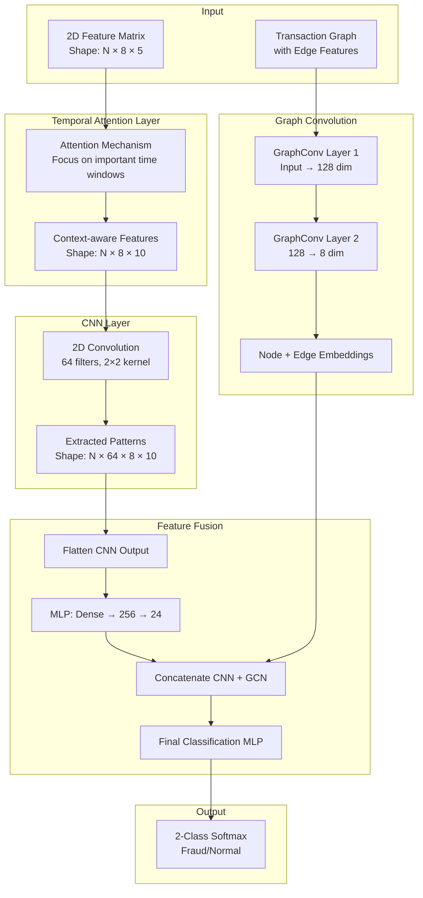
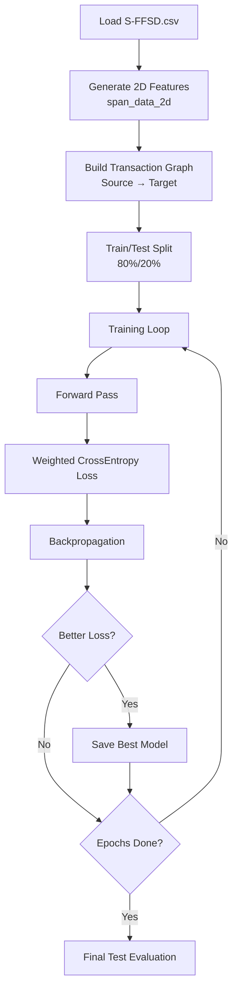
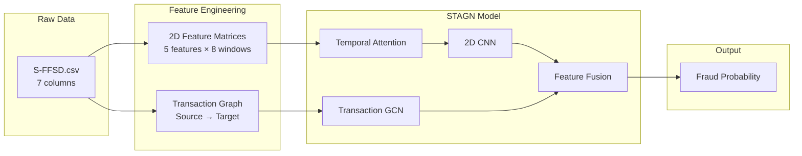

# STAGN Model Implementation - Complete Walkthrough

This document provides a comprehensive, detailed explanation of how the **STAGN (Spatial-Temporal Attention Graph Network)** model was built for fraud detection.

---

## 1. Overview: What Makes STAGN Different?

| Aspect | GTAN/RGTAN | STAGN |
|--------|------------|-------|
| **Input Shape** | 1D features (127 values per transaction) | 2D feature matrices (time × features) |
| **Graph Type** | Transaction similarity graph | Source-Target transaction graph |
| **Architecture** | Transformer + GNN | Attention + CNN + GCN |
| **Edge Features** | None | Location + Amount features |

**STAGN combines:**
- **Temporal Attention** - Focus on important time windows
- **2D Convolution (CNN)** - Extract spatial-temporal patterns
- **Graph Convolution (GCN)** - Learn from transaction relationships

---

## 2. Dataset Overview

### 2.1 Raw Dataset: S-FFSD

Same raw dataset as GTAN/RGTAN with 7 columns:

| Field | Description |
|-------|-------------|
| **Time** | Transaction timestamp |
| **Source** | Sender account ID |
| **Target** | Receiver account ID |
| **Amount** | Transaction amount |
| **Location** | Location code |
| **Type** | Transaction type |
| **Labels** | 0=normal, 1=fraud, 2=unknown |

---

## 3. Data Preprocessing: Creating 2D Feature Matrices

**File:** [`feature_engineering/data_engineering.py`](file:///c:/Users/Ski/Downloads/intern%206week/antifraud_cpu/feature_engineering/data_engineering.py) → `span_data_2d()` function

### 3.1 The Concept: 2D Representation

Instead of a single feature vector, STAGN creates a **2D matrix** for each transaction:

```
Traditional (GTAN):     STAGN 2D Matrix:
                        
[f1, f2, f3, ..., f127]    Time Window →
                        ┌──────────────────────────┐
                        │ Feat1  [w1][w2][w3]...[w8]│
                        │ Feat2  [w1][w2][w3]...[w8]│
                        │ Feat3  [w1][w2][w3]...[w8]│
                        │ Feat4  [w1][w2][w3]...[w8]│
                        │ Feat5  [w1][w2][w3]...[w8]│
                        └──────────────────────────┘
                        Shape: (5 features × 8 time windows)
```

### 3.2 Time Windows

8 different lookback periods:

```python
time_windows = [1, 3, 5, 10, 20, 50, 100, 500]
```

### 3.3 Features per Time Window (5 features)

For each time window, calculate:

| Feature | Description |
|---------|-------------|
| **AvgAmountT** | Average transaction amount in past T records |
| **TotalAmountT** | Total transaction amount in past T records |
| **BiasAmountT** | Current amount - AvgAmountT (deviation indicator) |
| **NumberT** | Number of transactions in past T records |
| **TradingEntropyT** | Change in transaction type diversity (entropy) |

### 3.4 Output Shape

```python
# Final feature matrix shape: (N, 5, 8)
# N = number of transactions
# 5 = number of features
# 8 = number of time windows

features.shape = (num_transactions, 5, 8)
```

**Stored in:** `data/features.npy` and `data/labels.npy`

---

## 4. Graph Construction (Transaction Graph)

**File:** [`methods/stagn/stagn_main.py`](file:///c:/Users/Ski/Downloads/intern%206week/antifraud_cpu/methods/stagn/stagn_main.py) → `load_stagn_data()` function

### 4.1 Different Graph Structure

Unlike GTAN/RGTAN which connect similar transactions, STAGN creates a **bipartite-like graph** between Source and Target accounts:

```python
# Create edges: Source → Target (transaction flow)
g = dgl.DGLGraph()
g.add_edges(encoded_source, encoded_target, data={"feat": edge_features})
```

### 4.2 Edge Features

Each edge carries **location and amount information**:

```python
# One-hot encode location
loc_enc = OneHotEncoder()
loc_feature = loc_enc.fit_transform(data['Location'].values[:, np.newaxis])

# Combine with normalized amount
edge_features = np.hstack([
    zscore(data['Amount'].to_numpy())[:, np.newaxis],  # Z-score normalized
    loc_feature.todense()                               # One-hot location
])
```

### 4.3 Graph Structure Visualization

```
     Source Accounts              Target Accounts
     
     ┌─────┐                      ┌─────┐
     │ S1  │──────────────────────│ T1  │
     └─────┘\                    /└─────┘
              \      Edge:      /
               \  [amt, L100]  /
     ┌─────┐    \            /    ┌─────┐
     │ S2  │─────\──────────/─────│ T2  │
     └─────┘      \        /      └─────┘
                   \      /
                    Edge:
     ┌─────┐     [amt, L101]      ┌─────┐
     │ S3  │──────────────────────│ T3  │
     └─────┘                      └─────┘
```

### 4.4 Graph Data Structure: DGL with Edge Features

STAGN uses **DGL (Deep Graph Library)** but with a key difference from GTAN/RGTAN: **edge features**.

#### Core Structure:

```python
import dgl

# Create empty DGL graph
g = dgl.DGLGraph()

# Add edges with FEATURES attached to each edge
g.add_edges(
    encoded_source,      # Source node indices
    encoded_target,      # Target node indices  
    data={"feat": torch.from_numpy(edge_features).to(torch.float32)}
)
```

#### Edge Feature Composition:

```python
# Edge features = [z-score(Amount), one-hot(Location)]
edge_features = np.hstack([
    zscore(data['Amount'].to_numpy())[:, np.newaxis],  # Normalized amount
    loc_enc.fit_transform(data['Location'].values)     # One-hot location
])

# Example edge feature vector:
# [0.52, 0, 0, 1, 0, 0, ...]  
#  ↑     ↑──────────────↑
#  |     One-hot location
#  Z-scored amount
```

#### Node Features (Initialized):

Unlike GTAN/RGTAN, STAGN initializes node features with Xavier uniform:

```python
g.ndata['feat'] = torch.nn.init.xavier_uniform_(
    torch.empty(g.num_nodes(), g.edata['feat'].shape[1])
).to(torch.float32)
```

#### Data Structures Summary:

| Component | Data Structure | Storage |
|-----------|----------------|---------|
| **Edge list** | COO Sparse Format | `g.edges()` |
| **Edge features** | Tensor `(E, feat_dim)` | `g.edata['feat']` |
| **Node features** | Tensor `(N, feat_dim)` | `g.ndata['feat']` (Xavier init) |
| **2D Features** | NumPy Array `(N, 5, 8)` | `data/features.npy` |
| **Labels** | NumPy Array `(N,)` | `data/labels.npy` |

---

## 5. Model Architecture

**File:** [`methods/stagn/stagn_2d.py`](file:///c:/Users/Ski/Downloads/intern%206week/antifraud_cpu/methods/stagn/stagn_2d.py)

### 5.1 Architecture Diagram



### 5.2 Component Details

#### 5.2.1 Temporal Attention Layer

Learns which time windows are most important for each transaction:

```python
def attention_layer(self, X):
    # For each time window, compute attention over all other windows
    for index, x_i in enumerate(time_windows):
        c_i = self.attention(x_i, all_windows, index)  # Context vector
        output = concat([x_i, c_i])  # Combine current + context
    
    # Output shape: (batch, 1, time_windows, feat_dim * 2)
    return output  # (N, 1, 8, 10)
```

**Attention formula:**
```
e_ij = V^T · tanh(W·x_i + U·x_j)     # Attention score
α_ij = softmax(e_ij)                  # Attention weight
c_i = Σ α_ij · x_j                    # Context vector
```

#### 5.2.2 2D CNN Layer

Extracts spatial-temporal patterns from the attention output:

```python
self.conv = nn.Conv2d(
    in_channels=1,           # Single input channel
    out_channels=64,         # 64 learned filters
    kernel_size=(2, 2),      # 2×2 convolution kernel
    padding='same'           # Preserve dimensions
)
```

The CNN slides over the 2D feature matrix to detect fraud patterns like:
- Sudden amount spikes across multiple time windows
- Unusual transaction frequency patterns

#### 5.2.3 Transaction GCN (Graph Convolution)

Learns from the Source→Target transaction graph:

```python
class TransactionGCN(nn.Module):
    def __init__(self, in_feats, hidden_feats=128, out_feats=8):
        self.conv1 = GraphConv(in_feats, hidden_feats)  # Node conv
        self.conv2 = GraphConv(hidden_feats, out_feats)
        self.lin1 = nn.Linear(in_feats, hidden_feats)   # Edge transform
        self.lin2 = nn.Linear(hidden_feats, out_feats)
    
    def forward(self, g, h, e):
        # Node convolution
        h1 = relu(self.conv1(g, h))
        e1 = relu(self.lin1(e))
        
        # Update edge features: src + dst + edge
        g.apply_edges(lambda edges: 
            {'x': edges.src['h'] + edges.dst['h'] + edges.data['x']})
        
        # Second layer
        h2 = self.conv2(g, h1)
        e2 = relu(self.lin2(e1))
        
        return node_embeddings, edge_embeddings
```

#### 5.2.4 Feature Fusion & Classification

Combines CNN patterns with graph embeddings:

```python
def forward(self, X_nume, g):
    # 1. Temporal attention
    out = self.attention_layer(X_nume)      # (N, 1, 8, 10)
    
    # 2. CNN feature extraction
    out = self.cnn_layer(out)               # (N, 64, 8, 10)
    
    # 3. Graph convolution
    node_embs, edge_embs = self.gcn(g, ...)
    
    # 4. Combine source, destination, edge features
    node_feats = stack([src_feat, dst_feat, edge_embs])  # (N, 3*8)
    
    # 5. Flatten CNN and pass through MLP
    out = flatten(out)                      # (N, 64*8*10)
    out = self.linears1(out)                # (N, 24)
    
    # 6. Concatenate CNN + GCN features
    out = concat([out, node_feats])         # (N, 24 + 24)
    
    # 7. Final classification
    out = self.linears2(out)                # (N, 2)
    
    return out
```

---

## 6. Training Process

**File:** [`methods/stagn/stagn_main.py`](file:///c:/Users/Ski/Downloads/intern%206week/antifraud_cpu/methods/stagn/stagn_main.py)

### 6.1 Training Configuration

From [`config/stagn_cfg.yaml`](file:///c:/Users/Ski/Downloads/intern%206week/antifraud_cpu/config/stagn_cfg.yaml):

```yaml
dataset: S-FFSD
test_size: 0.2              # 20% test, 80% train
epochs: 70                   # Training epochs
attention_hidden_dim: 150    # Attention layer hidden size
lr: 0.002                    # Learning rate
device: cpu
```

### 6.2 Training Pipeline



### 6.3 Training Details

1. **Class Weighting** (handles imbalanced data):
   ```python
   unique_labels, counts = torch.unique(labels, return_counts=True)
   weights = (1 / counts) * len(labels) / len(unique_labels)
   loss_func = nn.CrossEntropyLoss(weights)
   ```

2. **Optimizer:** Adam with lr=0.002
   ```python
   optimizer = torch.optim.Adam(model.parameters(), lr=0.002)
   ```

3. **Best Model Tracking:**
   ```python
   if loss < best_loss:
       best_loss = loss
       best_state = model.state_dict()
   ```

---

## 7. Evaluation Metrics

| Metric | Description |
|--------|-------------|
| **AUC-ROC** | Area Under ROC Curve |
| **F1-Score** | Macro-averaged F1 |
| **AP** | Average Precision |

```python
print(f"test set | auc: {roc_auc_score(true, pred):.4f}, "
      f"F1: {f1_score(true, pred, average='macro'):.4f}, "
      f"AP: {average_precision_score(true, pred):.4f}")
```

---

## 8. Summary Flow



---

## 9. Key Files Summary

| File | Purpose |
|------|---------|
| [`main.py`](file:///c:/Users/Ski/Downloads/intern%206week/antifraud_cpu/main.py) | Entry point |
| [`config/stagn_cfg.yaml`](file:///c:/Users/Ski/Downloads/intern%206week/antifraud_cpu/config/stagn_cfg.yaml) | Hyperparameters |
| [`methods/stagn/stagn_main.py`](file:///c:/Users/Ski/Downloads/intern%206week/antifraud_cpu/methods/stagn/stagn_main.py) | Data loading & training |
| [`methods/stagn/stagn_2d.py`](file:///c:/Users/Ski/Downloads/intern%206week/antifraud_cpu/methods/stagn/stagn_2d.py) | Model architecture |
| [`feature_engineering/data_engineering.py`](file:///c:/Users/Ski/Downloads/intern%206week/antifraud_cpu/feature_engineering/data_engineering.py) | 2D feature generation |

---

## 10. Running the Model

### Training:
```powershell
python main.py --method stagn
```

### Dashboard Inference:
```powershell
& 'cpu_env\Scripts\streamlit.exe' run streamlit_app.py
```

---

## 11. Comparison: STAGN vs GTAN vs RGTAN

| Aspect | STAGN | GTAN | RGTAN |
|--------|-------|------|-------|
| **Feature Shape** | 2D (5×8) | 1D (127) | 1D (127+6) |
| **Graph** | Source→Target | Transaction similarity | Transaction similarity |
| **Edge Features** | ✅ (Amount + Location) | ❌ | ❌ |
| **CNN** | ✅ 2D Conv | ❌ | ❌ |
| **Attention** | Temporal | Graph Transformer | Graph Transformer |
| **GNN Type** | GraphConv | TransformerConv | TransformerConv |
| **Risk Stats** | ❌ | ❌ | ✅ |

**Key Insight:** STAGN focuses on **sequential temporal patterns** within each transaction's history, while GTAN/RGTAN focus on **graph-based patterns** across related transactions.
